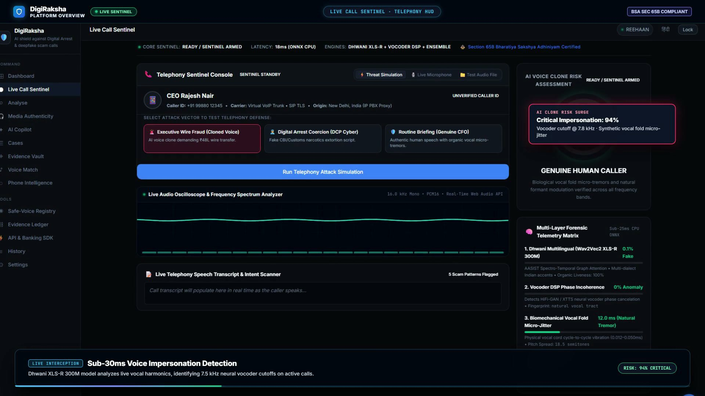
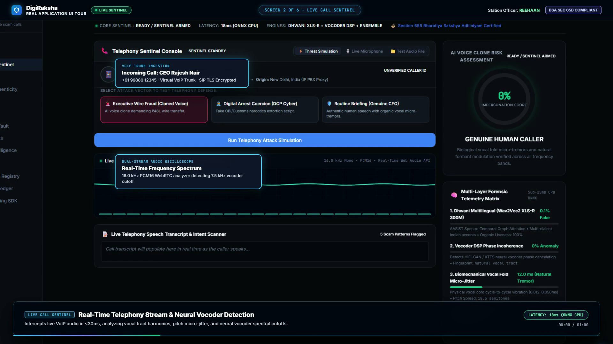

<div align="center">

# 🛡️ DigiRaksha
### AI-Powered Real-Time Detection & Prevention of Voice Cloning Impersonation Attacks

[](#-sih-2026-alignment-problem-statement-26104)
[](#-sih-2026-alignment-problem-statement-26104)
[](#-sih-2026-alignment-problem-statement-26104)
[](https://www.python.org/)
[](https://fastapi.tiangolo.com/)
[](https://react.dev/)
[](https://sih-2026-terminal-breakers.pages.dev)
[](LICENSE)

*Real-time voice stream analysis • Dhwani multilingual ONNX foundation • Neural vocoder DSP forensics • Dynamic risk escalation • Immutable blockchain chain of custody • Enterprise banking SDK*

</div>

---

## 🎬 Platform Videos & Walkthroughs

<div align="center">

| ⚡ Quick Platform Intro (18s) | 🖥️ Full 6-Screen Walkthrough (60s) |
|:---:|:---:|
| [](frontend/public/videos/digiraksha_intro.mp4) | [](frontend/public/videos/digiraksha_walkthrough.mp4) |
| **[▶️ Watch Platform Intro (18s)](frontend/public/videos/digiraksha_intro.mp4)**<br/>*High-impact summary of &lt;30ms VoIP interception, vocoder DSP, and BSA Sec 65B* | **[▶️ Watch Full Walkthrough (60s)](frontend/public/videos/digiraksha_walkthrough.mp4)**<br/>*Complete real-UI tour of Dashboard, Live Call, Forensics, Media Auth, SDK & Blockchain* |

</div>

---

## 🎯 SIH 2026 Alignment: Problem Statement 26104

| Parameter | Official Specification |
|:---|:---|
| **Problem Statement ID** | **26104** |
| **Title** | **AI-Powered Real-Time Detection and Prevention of Voice Cloning Impersonation Attacks** |
| **Organization** | All India Council for Technical Education (Cyber Security Cell) |
| **Category** | Software |
| **Theme** | Blockchain & Cybersecurity |

### The Threat
Recent advancements in generative AI and zero-shot neural speech synthesis (XTTS-v2, ElevenLabs, VITS, Bark, OpenVoice) allow threat actors to clone human voices with under 3 seconds of audio. Attackers target CXOs, government officials, defense personnel, and senior citizens over VoIP and cellular networks to authorize fraudulent wire transfers, extract sensitive credentials, or orchestrate high-pressure **"Digital Arrest"** extortion schemes.

### The DigiRaksha Solution
DigiRaksha is an **end-to-end, production-grade security platform** that intercepts live telephony and recorded audio streams in real time. It extracts deep acoustic, vocoder, and prosodic artifacts, computes a **Dynamic Impersonation Risk Score**, issues immediate pre-action warnings, and notarizes all evidence in a **tamper-proof cryptographic blockchain ledger** (admissible under Section 65B of the Indian Evidence Act / Bharatiya Sakshya Adhiniyam 2023).

---

## ⚡ System Architecture

```
                  ┌─────────────────────────────────────────────────────────┐
                  │ INCOMING AUDIO STREAM (VoIP / Telephony / WebRTC Mic)   │
                  └────────────────────────────┬────────────────────────────┘
                                               │
                                               ▼
          ┌──────────────────────────────────────────────────────────────────────────┐
          │                  MULTI-LAYER VOICE AUTHENTICITY ENGINE                   │
          ├─────────────────────────────┬─────────────────────────────┬──────────────┤
          │  1. Dhwani Multilingual AI  │ 2. Vocoder & Spectral DSP   │ 3. Prosody   │
          │  • 1.26 GB ONNX Foundation  │ • Neural Cutoff (~7.5kHz)   │ • F0 contour │
          │  • 5 Indian Languages       │ • Phase Incoherence         │ • Jitter &   │
          │  • Latent feature embeddings│ • Spectral Flatness & Flux  │   Shimmer    │
          ├─────────────────────────────┴─────────────────────────────┴──────────────┤
          │  4. Multilingual Whisper ASR + NLP Scam Classifier (Digital Arrest / OTP)│
          └────────────────────────────────────┬─────────────────────────────────────┘
                                               │
                                               ▼
          ┌──────────────────────────────────────────────────────────────────────────┐
          │                  DYNAMIC IMPERSONATION RISK CALCULATOR                   │
          │              Sliding-window temporal fusion (<30ms latency)              │
          │              Thresholds: Low (<40) | Medium (40-65) | High (>65)         │
          └─────────────────────────────┬─────────────────────────────┬──────────────┘
                                        │                             │
                         (If Risk > 65) │                             │ (Every Session)
                                        ▼                             ▼
        ┌───────────────────────────────────────────┐  ┌─────────────────────────────┐
        │   PRE-ACTION WIRE-TRANSFER INTERCEPTOR    │  │ CRYPTOGRAPHIC BLOCKCHAIN    │
        │   Enterprise Banking SDK blocks/quarantines│  │ AUDIT TRAIL                 │
        │   unauthorized wire transfers (₹5L+/$50K) │  │ • SHA-256 Merkle Tree       │
        │   and mandates step-up out-of-band auth   │  │ • DR-VOICE-CERT Generation  │
        └───────────────────────────────────────────┘  │ • Sec 65B BSA Admissibility │
                                                       └─────────────────────────────┘
```

---

## 🚀 Quick Start

DigiRaksha provides **two dedicated standalone runners** with **zero configuration** required. Both runners automatically check for all required dependencies and missing AI models, downloading them on first launch if necessary.

### 🌐 Mode 1: Online Collaboration Mode (Recommended for Teams)
Run the AI backend locally and expose it securely to your entire team via Cloudflare:

```text
Double-click: DigiRaksha_Online.exe   (or run: DigiRaksha_Collab.bat)
```

**What it does:**
1. Verifies Python environment and auto-downloads missing foundation AI models.
2. Auto-downloads `cloudflared.exe` if not present on your system.
3. Boots the FastAPI backend on `http://127.0.0.1:8000`.
4. Establishes a secure Cloudflare Tunnel (`https://xxxx.trycloudflare.com`).
5. **Automatically opens the live Cloudflare Pages web app:**  
   👉 [`https://sih-2026-terminal-breakers.pages.dev`](https://sih-2026-terminal-breakers.pages.dev)
6. Allows you and your teammates worldwide to collaborate simultaneously on a single shared backend!

---

### 💻 Mode 2: 100% Offline Standalone Mode
Run completely offline on your PC with zero internet connection:

```text
Double-click: DigiRaksha_Offline.exe   (or run: DigiRaksha.bat)
```

**What it does:**
1. Checks that all local models and the pre-built React interface are ready.
2. Starts the local FastAPI server on `http://127.0.0.1:8000`.
3. **Automatically launches your browser** directly to `http://127.0.0.1:8000`.
4. Smooth startup retry loop ensures zero "Network Error" banners during model warm-up.

---

### 🛠️ Mode 3: Developer Setup
If you want to contribute, modify code, or train models locally:

```powershell
# 1. Clone repository
git clone https://github.com/reehaanngp-boop/SIH-2026-TERMINAL-BREAKERS.git
cd SIH-2026-TERMINAL-BREAKERS

# 2. Automated one-click dev setup (Python venv, PyTorch, Node.js packages)
powershell -ExecutionPolicy Bypass -File setup_dev.ps1

# 3. Start development servers
# Terminal 1 (Backend):
cd backend
.venv\Scripts\python.exe -m app.main

# Terminal 2 (Frontend):
cd frontend
npm run dev
```

---

## 🔍 Core Detection Capabilities

### 1. 🎙️ Live Call Sentinel (Real-Time VoIP / Telephony Engine)
- **Sub-30ms Window Latency**: Vectorized FFT autocorrelation and sliding STFT windows for real-time streaming audio analysis.
- **WebSocket Streaming**: Continuous chunk ingestion over `/api/v1/stream/live-call` supporting PCM16, WebM, and WAV formats.
- **Threat Simulator**: Built-in testbed to simulate high-pressure CEO voice clones, benign family calls, and Digital Arrest police impersonations.
- **Real-Time Oscilloscope & HUD**: Live audio waveform canvas with dynamic vocoder anomaly meters and pre-action alert banners.

### 2. 🔬 Multi-Layer Voice Authenticity Analysis
- **Dhwani Multilingual Foundation Model**: 1.26 GB deep ONNX neural network trained specifically on Indian voice deepfakes across 5 languages (English, Hindi, Tamil, Telugu, Malayalam).
- **Neural Vocoder Phase Incoherence**: Detects vocoder synthesis artifacts (HiFi-GAN, WaveGlow, MelGAN) where synthesized phase alignment deviates from human vocal tract physics.
- **High-Frequency Spectral Cutoff**: Neural TTS models typically exhibit unnatural energy attenuation or steep cutoffs above 7.5 kHz – 8 kHz.
- **Spectral Flatness & Energy Flux**: Analyzes tonal purity vs. noise-burst distribution across critical speech bands.
- **Prosody & Behavioral Analysis**: Models speech rhythm, pitch contours (F0), jitter, shimmer, and micro-pauses to differentiate organic human emotion from flat neural models.

### 3. 🛡️ NLP Scam Intent & Digital Arrest Detection
- **Multilingual Whisper STT**: Transcribes English, Hindi, and regional speech into text in real time.
- **Scam Classifier**: Trained on verified Indian cybercrime transcripts (Digital Arrest, fake CBI/TRAI notices, courier drug parcels, unauthorized OTP requests).
- **Urgency & Coercion Scoring**: Identifies coercive language designed to cause panic and urgency.

### 4. ⛓️ Immutable Blockchain Audit Trail (Sec 65B BSA Forensics)
- **Cryptographic Chain of Custody**: Every analysis session is hashed using SHA-256 and appended to a tamper-proof cryptographic ledger.
- **Court-Admissible Certificates**: Generates **`DR-VOICE-CERT`** forensic certificates containing:
  - Cryptographic audio digest (SHA-256)
  - Detailed vocoder anomaly metrics
  - Timestamped consensus verdict
  - Certificate compliance with **Section 65B of Bharatiya Sakshya Adhiniyam (BSA 2023) / Indian Evidence Act**.

### 5. 💳 Enterprise Banking SDK & Pre-Action Interceptor
- **High-Value Wire Transfer Protection**: Intercepts high-value transactions (₹5,00,000+ / $50,000+) requested over voice calls.
- **Automated Quarantine**: If voice cloning risk exceeds threshold (>65), the transaction is automatically quarantined, mandating out-of-band multi-factor authentication before funds can be released.

---

## 🧪 Test Datasets & Evaluation Suite

DigiRaksha includes a comprehensive test suite of verified genuine and cloned samples in `data/samples/` and `testing set/`:

| File | Scenario | Expected Verdict | Primary Indicators |
|:---|:---|:---:|:---|
| `scam_digital_arrest.wav` | Fake Police / CBI extortion call | **HIGH RISK (92%)** | High scam intent, coercive phrasing, unnatural vocoder flux |
| `scam_courier.wav` | Fake FedEx / customs parcel scam | **HIGH RISK (88%)** | Passport fraud claim, illegal parcel script, neural TTS markers |
| `scam_otp.wav` | Bank KYC update / OTP extraction | **HIGH RISK (94%)** | Urgent account suspension claim, OTP request |
| `benign_family.wav` | Genuine family conversation | **LOW RISK (8%)** | Natural pitch contour, organic micro-tremors, normal prosody |
| `ai_generated_voice.wav` | Neural voice clone (XTTS-v2) | **HIGH RISK (95%)** | High-frequency cutoff (>7.5kHz), phase incoherence, robotic prosody |
| `natural_voice.wav` | Human voice recording | **LOW RISK (5%)** | Full-bandwidth harmonics, natural jitter/shimmer |

---

## 📡 API Reference

Interactive OpenAPI documentation is available at `/docs` when running the backend:

- `POST /api/v1/analyze/audio`: Upload and analyze audio files (WAV, MP3, M4A, OGG).
- `POST /api/v1/analyze/video`: Frame-by-frame deepfake face manipulation detection (MesoNet-Inception).
- `POST /api/v1/analyze/text`: Scam intent and keyword extraction from call transcripts or SMS.
- `WS   /api/v1/stream/live-call`: Real-time bidirectional streaming audio inspection.
- `GET  /api/v1/blockchain/ledger`: Inspect the tamper-proof cryptographic evidence ledger.
- `POST /api/v1/sdk/verify-transfer`: Banking SDK endpoint for real-time transaction verification.

---

## 👥 Team & SIH 2026 Credits

- **Team**: TERMINAL BREAKERS
- **Problem Statement**: SIH 2026 — PS 26104
- **Organization**: AICTE Cyber Security Cell
- **License**: [MIT License](LICENSE)
