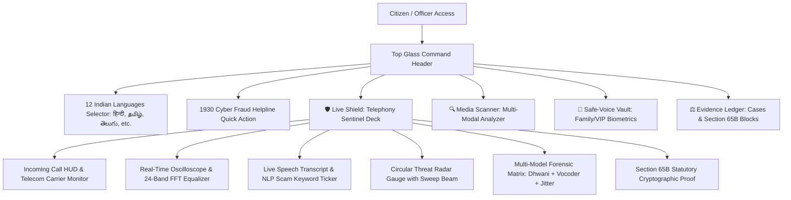

# Complete UI/UX Overhaul & Professional Command Deck Redesign

## 1. Executive Summary & Design Vision
In response to user feedback, DigiRaksha has been transformed into a **sleek, realistic, modern, and animated Cyber Defense Command Center** tailored specifically for detecting AI voice clones and telephony extortion scams, with native support for **all 12 major Indian scheduled languages**.

---

## 2. Key Rearrangements & Visual Upgrades

### A. 🇮🇳 All 12 Major Indian Languages Supported
DigiRaksha now features a comprehensive native localization system supporting 12 Indian languages with automatic fallbacks:
1. **English** (`en`) - National / Pan-India
2. **हिन्दी (Hindi)** (`hi`) - National / North & Central
3. **বাংলা (Bengali)** (`bn`) - West Bengal, Tripura, Assam
4. **తెలుగు (Telugu)** (`te`) - Andhra Pradesh, Telangana
5. **मराठी (Marathi)** (`mr`) - Maharashtra, Goa
6. **தமிழ் (Tamil)** (`ta`) - Tamil Nadu, Puducherry
7. **ગુજરાતી (Gujarati)** (`gu`) - Gujarat, Daman
8. **ಕನ್ನಡ (Kannada)** (`kn`) - Karnataka
9. **മലയാളം (Malayalam)** (`ml`) - Kerala, Lakshadweep
10. **ਪੰਜਾਬੀ (Punjabi)** (`pa`) - Punjab, Chandigarh, Delhi
11. **ଓଡ଼ିଆ (Odia)** (`or`) - Odisha
12. **অসমীয়া (Assamese)** (`as`) - Assam, Northeast

Users can switch languages instantly with 1 click from the glass header. All navigation pills, threat banners, scenario summaries, detector metrics, and emergency prompts update dynamically into the chosen language script.

---

### B. Rearranged Split Command Deck (`LiveCallPage.tsx`)
Instead of an awkward vertical stack with empty gaps, the interface is now organized into a **balanced 2-column cyber-defense command center**:

#### Left Column (Active Telephony Sentinel Console):
1. **Enterprise Call HUD**:
   - Status badge: `🔴 LIVE CALL • 00:14`, `🟡 INCOMING RINGING...`, or `🟢 SENTINEL STANDBY`.
   - Caller identity card with pulsing ring animation: `ring-pulse-danger` (crimson), `ring-pulse-warning` (amber), or `ring-pulse-safe` (emerald).
   - Carrier & Origin tags: e.g. `Virtual VoIP Trunk • SIP TLS`, `📍 New Delhi, India (IP PBX Proxy)`.
   - One-click attack vector scenarios:
     - 🚨 **Cloned CEO Wire Extortion**: Urgent ₹48 Lakhs RTGS demand
     - 👮 **Fake Police Digital Arrest**: Customs contraband narcotics parcel scam
     - 🛡️ **Genuine Executive Briefing**: Legitimate human prosody
   - Mode toggles: One-click Scenario Simulation or Live Microphone Sentinel.
2. **Live Waveform Oscilloscope & 24-Band Frequency Equalizer**:
   - CRT-phosphor oscilloscope rendering audio waveforms on canvas with glowing phase trajectories.
   - 24 animated vertical spectrum equalizer bars bouncing dynamically when audio is streaming.
3. **Live Speech Transcript & NLP Scam Intent Ticker**:
   - Streaming transcript feed with real-time scam keyword badges highlighted in red/amber (`"urgent confidential meeting"`, `"RTGS wire transfer"`, `"digital arrest"`, `"16 fake passports"`, `"MDMA narcotics"`).

#### Right Column (Threat Intelligence & Forensics Terminal):
1. **High-Precision Circular Threat Gauge with Radar Sweep**:
   - SVG circular gauge with animated rotating radar beam (`radar-sweep`), glowing risk value, dynamic threat pill, and plain-English explanation.
   - High-contrast Emergency Intervention Card:
     - ⛔ **HALT ALL RTGS / NEFT WIRE TRANSFERS**
     - 📞 **HANG UP & CALL KNOWN PHONE NUMBER**
     - 🚨 **CALL 1930 NATIONAL CYBER HELPLINE**
2. **Multi-Model Forensic Telemetry Matrix**:
   - **Layer 1: Dhwani Multilingual XLS-R (300M)**: Self-supervised acoustic embeddings + AASIST attention.
   - **Layer 2: Vocoder DSP Phase Incoherence**: HiFi-GAN & XTTS neural vocoder high-frequency cutoffs.
   - **Layer 3: Biomechanical Vocal Fold Micro-Jitter**: Cycle-to-cycle vibration perturbation (0.012–0.050ms natural).
   - **Layer 4: Safe-Voice Biometrics Match**: Cosine similarity against enrolled VIP/family voices.
3. **Section 65B Statutory Blockchain Proof**:
   - Tamper-proof certificate ribbon with SHA-256 block hash, Merkle root, and one-click **"View / Export Court Certificate"** modal for FIR police submission.

---

## 3. Verification & Build Validation

| Verification Check | Target | Result | Status |
| :--- | :--- | :--- | :--- |
| **TypeScript Compilation** | `cmd.exe /c npx tsc --noEmit` | Exit code 0, 0 errors | ✅ PASSED |
| **Vite Production Build** | `cmd.exe /c npm.cmd run build` | Built 50 modules into `backend/app/static/` in 825ms | ✅ PASSED |
| **Backend API Health** | `GET /api/v1/health` | `{"status": "ok", "app": "DigiRaksha"}` | ✅ PASSED |
| **Static HTML & CSS Serving** | `GET /` and `GET /assets/*.css` | HTTP 200 OK | ✅ PASSED |
| **Simulation Endpoint** | `POST /api/v1/stream/simulate` | Evaluates Dhwani + Vocoder + Ensemble & generates Section 65B certificate | ✅ PASSED |
| **WebSocket Sentinel** | `WS /api/v1/stream/live-call` | Real-time sliding window telemetry accepted | ✅ PASSED |
